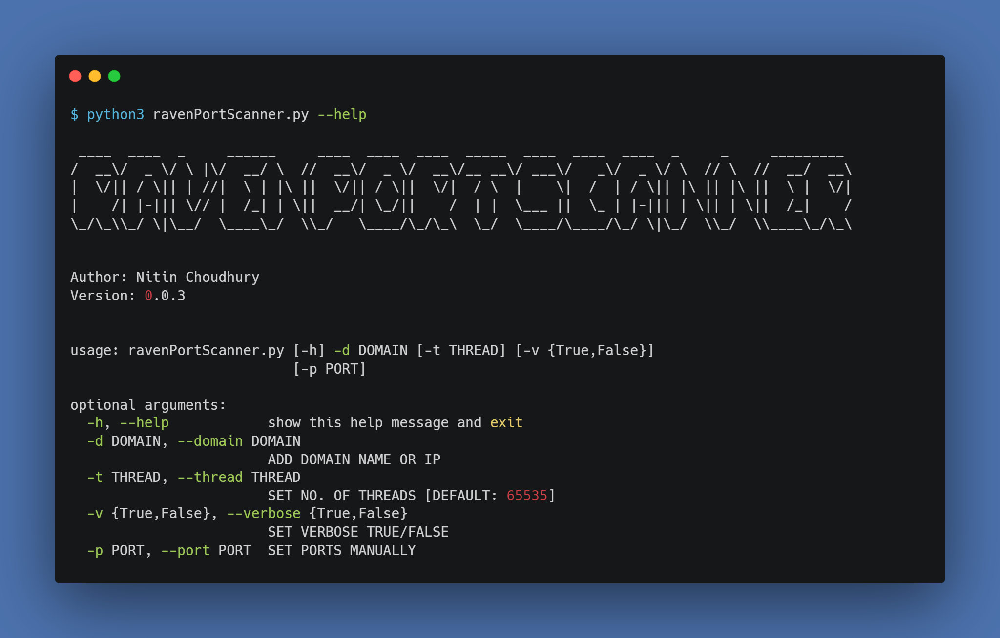
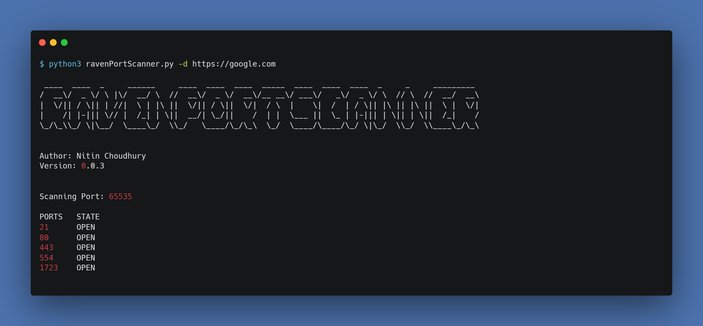
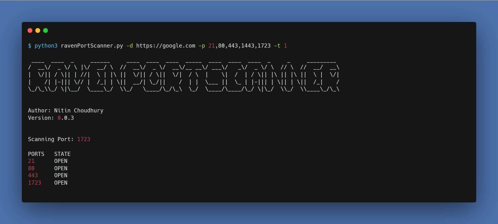

# RavenPortScanner

A python based tool for scanning open ports of a domain or an IP address. Functional with multi-threading mode. Be careful using the tool since it can be treated as DoS attack and your IP can be blocked by the host.

# Requirements

This is a python based file. So, to run this file you will require a python environment.

## Set-Up

Step-1: Download the zip file or clone

`git clone https://github.com/nitin293/RavenPortScanner`

Step-2: Run the file

```
cd RavenPortScanner/
python3 ravenPortScanner.py --help
```



## Uses

* Scanning port with default configuration

`python3 ravenPortScanner.py -d https://google.com`



* Scanning specific port with manual number of threads

`python3 ravenPortScanner.py -d https://google.com -p 21,80,443,1443,1723 -t 1`

